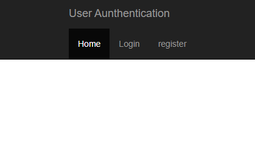

#  **User-Authentication-API**
 

> ## *This is a Passport.js based Authentication API*
 

> ### *It can perform following tasks*
* Sign-up a new user
* Verify a new user by sending verification email
* Resend the verification email
* Logging in a existing user
* Reset the password by sending reset password email
* Admin panel has been provided(user Routes are for admin panel)

  

## *Major NPM Libraries Used*

* Express.js ->For setting up server
* Passport.js ->For User authentication
* jsonwebtoken ->For generating tokens
* Cors ->For cross origin resource sharing
* Bcrypt ->For Hashing passwords
* SendGridApi ->For sending verification Emails
* Mongoose -> For database schema

 

> PUG(Jade earlier) is used as template engine

 

> ## *MongoDB is used for database services*
 
 

## **User Authentication page of API**

 
 

## **SignUp page of API**

 
 

## **Login page of API**

 
 

